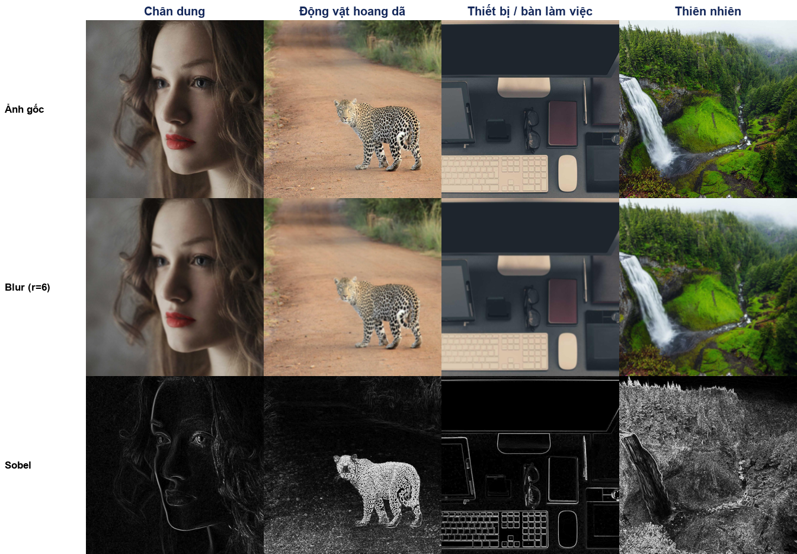
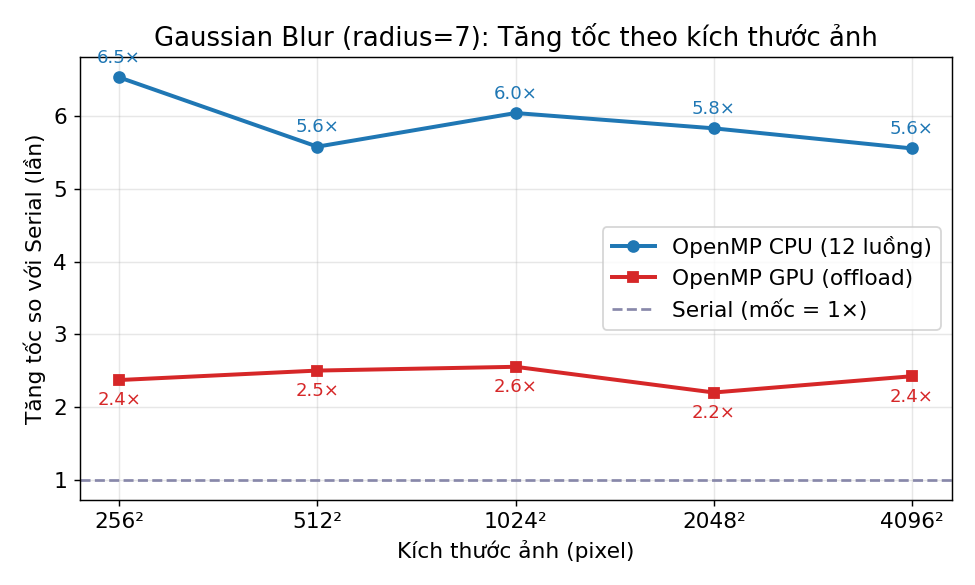
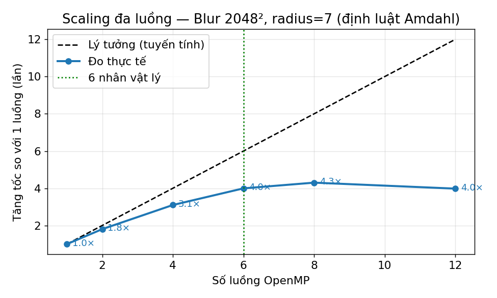
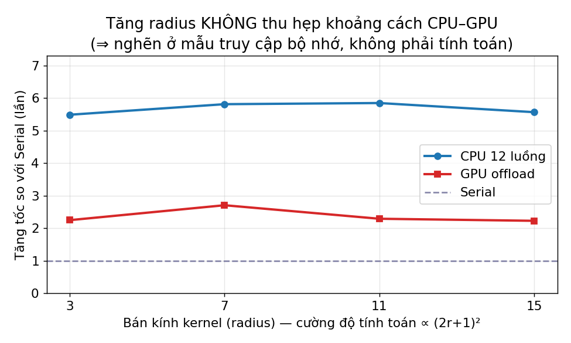
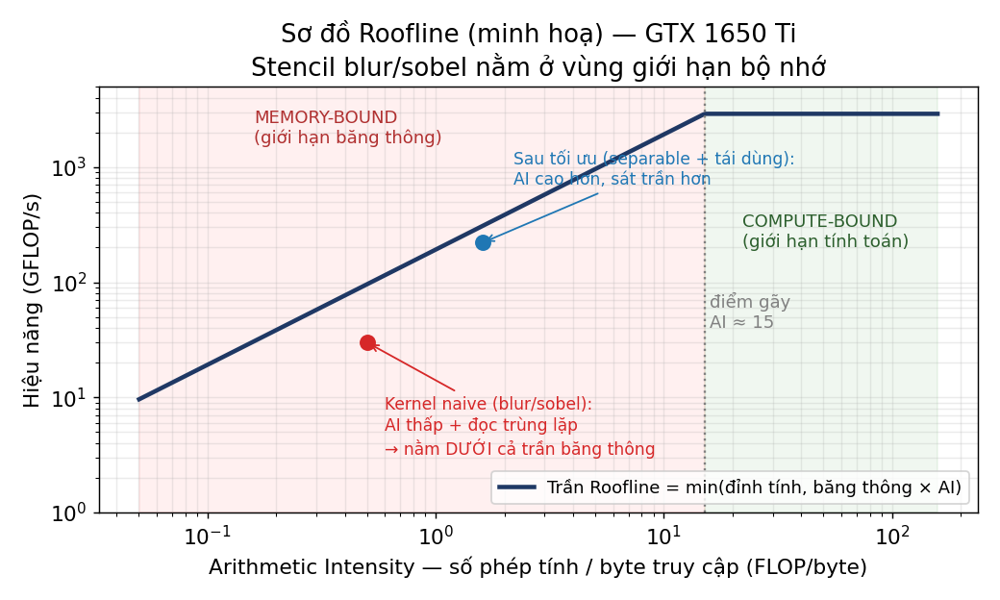
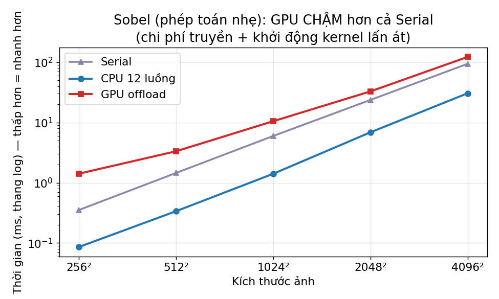
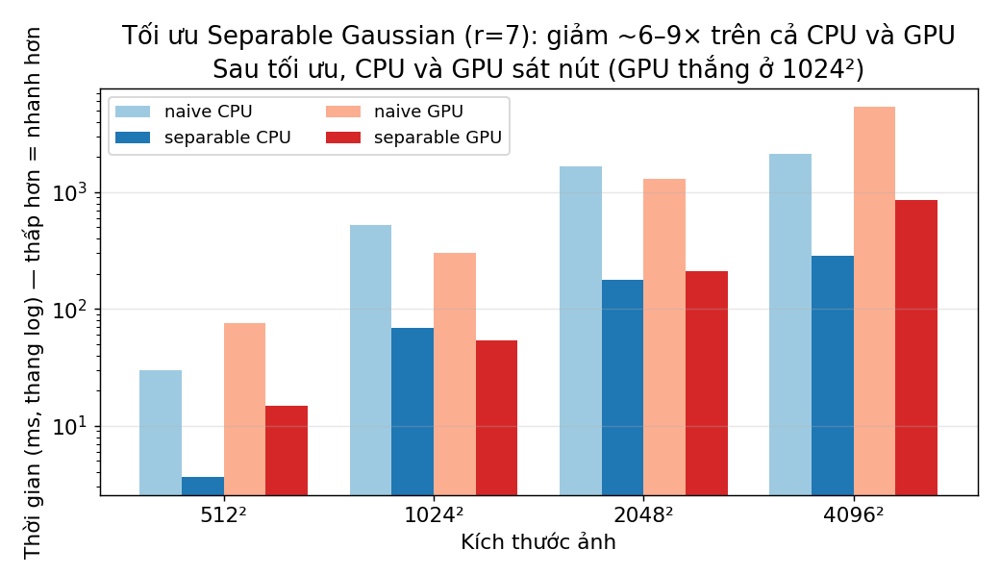

# BÁO CÁO CUỐI KÌ — Xử lý ảnh song song trên CPU/GPU với OpenMP

**Đề tài:** Làm mờ Gaussian & Dò biên Sobel — minh hoạ *performance portability* của OpenMP
**Môn học:** Lập trình GPU và Tính toán song song — Đại học Việt Nhật (VJU)
**Sinh viên:** ____________________  **MSSV:** ____________  **GVHD:** ____________  **Năm:** 2026

> *Tài liệu Markdown này là bản gốc (master) của đồ án; bộ slide được dựng trực tiếp từ nội dung ở đây.*

---

## Tóm tắt

Đồ án hiện thực một chương trình xử lý ảnh (làm mờ Gaussian và dò biên Sobel) và cho nó chạy trên **ba mức song song hoá** — tuần tự, OpenMP đa luồng CPU, và OpenMP offload GPU — từ **cùng một mã nguồn**, chỉ thay đổi vài chỉ thị `#pragma omp`. Qua đó minh hoạ triết lý *khả chuyển hiệu năng (performance portability)* của OpenMP. Kết quả thực đo trên laptop (CPU i7‑10750H, GPU GTX 1650 Ti, chạy qua WSL): CPU đa luồng đạt tăng tốc ổn định **~5.5–6.5×** so với tuần tự và tuân theo định luật Amdahl; bản GPU "ngây thơ" chỉ nhanh ~2.4× và **thua CPU** do bị giới hạn bởi truy cập bộ nhớ. Sau khi tối ưu bằng **Gaussian tách rời (separable) + giữ dữ liệu thường trú trên GPU**, cả hai nhanh thêm **~6–9×** và GPU vượt CPU ở ảnh 1024². Bài học cốt lõi: *tối ưu thuật toán/bộ nhớ quan trọng hơn việc chọn CPU hay GPU.*

---

## 1. Giới thiệu

### 1.1. Đặt vấn đề
Một bức ảnh độ phân giải cao chứa hàng chục triệu điểm ảnh (pixel); mỗi phép biến đổi phải tính cho từng pixel. Thực thi tuần tự trên một nhân CPU trở nên chậm khi ảnh lớn. Điểm mấu chốt: các phép xử lý ảnh dạng **stencil** tính mỗi pixel đầu ra **độc lập** với nhau, nên rất phù hợp để song song hoá.

### 1.2. Mục tiêu
Minh hoạ *performance portability*: dùng **một** mã nguồn OpenMP chạy được cả CPU lẫn GPU, song song hoá **tăng dần** chỉ bằng directive, rồi **đo đạc và giải thích** hiệu năng.

### 1.3. Đóng góp
1. Một chương trình C++/OpenMP thống nhất chạy 3 chế độ (serial / cpu / gpu) và tự kiểm chứng tính đúng đắn.
2. Khảo sát thực nghiệm đầy đủ: tăng tốc theo kích thước, khả năng mở rộng theo số luồng, ảnh hưởng cường độ tính toán.
3. Phân tích trung thực lý do GPU phổ thông chưa vượt CPU cho bài toán này, và một tối ưu (separable) giúp GPU bứt lên.

---

## 2. Cơ sở lý thuyết

### 2.1. OpenMP và mô hình fork–join
OpenMP là chuẩn lập trình song song **bộ nhớ chia sẻ**, điều khiển bằng chỉ thị `#pragma omp`. Chương trình chạy bằng một luồng chính; gặp vùng song song thì **fork** ra một nhóm luồng cùng làm, xong thì **join** về một luồng.

- `parallel for`: chia các lần lặp của vòng `for` cho các luồng (work‑sharing).
- `collapse(2)`: gộp hai vòng lồng nhau `(y, x)` thành một không gian lặp lớn để chia đều hơn.
- `schedule(static)`: chia tĩnh các khối bằng nhau — tối ưu khi mọi lần lặp tốn công như nhau.
- **Race condition**: lỗi khi ≥2 luồng cùng ghi một ô nhớ không đồng bộ. Bài này **không** gặp vì mỗi luồng ghi vào pixel đầu ra riêng; ảnh vào chỉ đọc → không cần `critical`/`atomic`.

### 2.2. Offload GPU với OpenMP
- `target`: chuyển thực thi sang thiết bị (GPU).
- `teams distribute`: tạo nhiều nhóm (≈ *thread block* CUDA), chia lặp mức khối.
- `parallel for`: trong mỗi nhóm chia tiếp cho các luồng (≈ *threads/warps*).
- `map(to:)`/`map(from:)`: truyền dữ liệu vào/ra GPU. Con trỏ heap phải khai báo *array section* `in[0:n]`.

### 2.3. Phân cấp bộ nhớ, Arithmetic Intensity, Roofline
Bộ nhớ xếp thành tầng: **thanh ghi → cache → RAM/VRAM**; càng xa càng chậm (~100×). Thuật toán tái dùng dữ liệu ở tầng gần (locality tốt) sẽ nhanh hơn.

**Arithmetic Intensity (AI)** = số phép tính / số byte truy cập. AI thấp → giới hạn băng thông (*memory‑bound*); AI cao → giới hạn tính toán (*compute‑bound*). Mô hình **Roofline** (Hình 6) cho biết ranh giới này.

### 2.4. Mô hình thực thi GPU
- **SIMT/warp**: GPU chạy luồng theo nhóm 32; rẽ nhánh khác nhau → chạy tuần tự (divergence).
- **Coalescing**: 32 luồng đọc 32 ô liền nhau → gộp 1 giao dịch; đọc rải rác → phí băng thông.
- **Occupancy**: nhiều warp hoạt động để "che" độ trễ bộ nhớ.

---

## 3. Thuật toán

### 3.1. Làm mờ Gaussian
Mỗi pixel ra là trung bình có trọng số của cửa sổ `(2r+1)×(2r+1)`, trọng số Gauss, chuẩn hoá tổng = 1:

```
out(x,y) = Σ Σ  in(x+i, y+j) · K(i,j),   i,j ∈ [-r, r]
K(i,j) ∝ exp( -(i² + j²) / 2σ² ),   Σ K = 1
```

Chi phí: `(2r+1)²` phép nhân–cộng / pixel / kênh. Với `r=7` (cửa sổ 15×15) là 225 phép → đủ nặng (*compute‑heavy*).

### 3.2. Dò biên Sobel
Hai nhân chập 3×3 xấp xỉ gradient độ sáng; độ lớn gradient cho biên:

```
Gx = [-1 0 1; -2 0 2; -1 0 1]     Gy = [-1 -2 -1; 0 0 0; 1 2 1]
G(x,y) = sqrt(Gx² + Gy²)   (kẹp về [0,255])
```

Chỉ 9 phép/pixel → **rất nhẹ**, *memory‑bound*. Chọn có chủ đích để cho thấy khi việc quá nhẹ thì offload GPU không có lợi.

---

## 4. Thiết kế và cài đặt

### 4.1. Kiến trúc: một nguồn, ba chế độ
Toàn bộ trong `src/imgproc.cpp`. Đọc/ghi ảnh bằng thư viện single‑header `stb_image`; xử lý ở kiểu `float` rồi làm tròn về 8‑bit khi ghi. Tham số dòng lệnh chọn phép toán và chế độ, có `--check` (so với serial) và đo thời gian có warm‑up.

### 4.2. Bản tuần tự và OpenMP CPU
Bản CPU đa luồng chỉ khác bản tuần tự **đúng một dòng chỉ thị**:

```cpp
#pragma omp parallel for collapse(2) schedule(static)
for (int y = 0; y < H; ++y)
  for (int x = 0; x < W; ++x)
    for (int c = 0; c < C; ++c) { /* tích chập tại (x,y,c) — y hệt bản serial */ }
```

### 4.3. OpenMP GPU offload
Cùng vòng lặp, chỉ đổi chỉ thị và thêm ánh xạ dữ liệu:

```cpp
#pragma omp target teams distribute parallel for collapse(2) \
        map(to: in[0:n], kern[0:k]) map(from: out[0:n])
for (int y = 0; y < H; ++y)
  for (int x = 0; x < W; ++x)
    for (int c = 0; c < C; ++c) { /* ... vẫn vòng lặp đó ... */ }
```

### 4.4. Kiểm chứng tính đúng đắn
Với `--check`, chương trình chạy bản serial làm chuẩn rồi so sai khác từng pixel. Bản CPU **khớp bit** (maxdiff = 0); bản GPU lệch ~`6×10⁻⁵` do phép **FMA** (nhân–cộng hợp nhất) làm tròn khác — sau khi về 8‑bit, ảnh giống hệt nhau.

### 4.5. Chỉ rõ chỗ tính toán song song — dùng OpenMP (không phải CUDA)

Dự án dùng **OpenMP** (các chỉ thị `#pragma omp`), **không dùng CUDA**. Lý do: OpenMP cho phép **cùng một mã nguồn** chạy trên cả CPU lẫn GPU (performance portability); còn CUDA chỉ chạy trên GPU NVIDIA và phải tự viết kernel + quản lý truyền bộ nhớ (nhiều code hơn). Đánh đổi: CUDA nếu tinh chỉnh sâu có thể nhanh hơn — thuộc hướng phát triển.

Bảng dưới chỉ rõ **đâu là phần tính toán song song** trong từng file/hàm và nó chạy ở đâu:

| Nơi trong code | Dòng làm cho song song | Chạy ở đâu |
|---|---|---|
| `imgproc.cpp` · `blur_serial()` | (không có pragma) — vòng lặp thường | 1 luồng CPU |
| `imgproc.cpp` · `blur_cpu()` | `#pragma omp parallel for collapse(2) schedule(static)` | Nhiều luồng CPU |
| `imgproc.cpp` · `blur_gpu()` | `#pragma omp target teams distribute parallel for collapse(2)` | GPU (team × luồng) |
| `imgproc.cpp` · `sobel_gpu()` | `#pragma omp target teams distribute parallel for` | GPU |
| `blur_optim.cpp` · `sep_gpu()` | `#pragma omp target data` + 2× `target teams distribute parallel for` | GPU, dữ liệu thường trú |

Phần tính toán chính là bốn vòng lặp lồng nhau (duyệt pixel `y, x`, kênh màu `c`, và cửa sổ lân cận). **Chỉ thị đặt NGAY TRƯỚC vòng lặp `y` chính là chỗ biến nó thành song song:**

```cpp
// (1) CPU đa luồng — chia vòng lặp (y,x) cho các luồng CPU:
#pragma omp parallel for collapse(2) schedule(static)      // <-- CHỖ SONG SONG (CPU)
for (int y = 0; y < H; ++y)
  for (int x = 0; x < W; ++x)
    for (int c = 0; c < C; ++c) { /* tích chập Gaussian tại (x,y,c) */ }

// (2) GPU offload — CÙNG vòng lặp, chỉ đổi directive + khai báo truyền dữ liệu:
#pragma omp target teams distribute parallel for collapse(2) \   // <-- CHỖ SONG SONG (GPU)
        map(to: in[0:n], kern[0:k]) map(from: out[0:n])
for (int y = 0; y < H; ++y) /* ... vẫn vòng lặp đó ... */
```

`collapse(2)` gộp hai vòng `y, x` để chia đều; trên GPU, `teams distribute` chia ở mức khối còn `parallel for` chia ở mức luồng trong khối — phủ kín hàng nghìn nhân của GPU.

---

## 5. Thiết lập thực nghiệm

| Thành phần | Chi tiết |
|---|---|
| CPU | Intel Core i7‑10750H — 6 nhân / 12 luồng (Hyper‑Threading) |
| GPU | NVIDIA GTX 1650 Ti — Turing (sm_75), 4 GB VRAM |
| Hệ điều hành | WSL2 · Ubuntu 24.04 · GPU qua `/dev/dxg` |
| Trình biên dịch | GCC 13.3 + offload nvptx · CUDA 13.2 |
| Đo thời gian | `omp_get_wtime` · warm‑up + lấy min/trung bình N lần |

CPU và GPU đo trong **cùng môi trường WSL, cùng GCC 13** để so sánh công bằng. Ảnh test tổng hợp giàu chi tiết ở các kích thước 256²→4096²; demo dùng nhiều ảnh thật khác thể loại.

---

## 6. Kết quả

### 6.1. Minh hoạ trực quan trên nhiều ảnh
Cùng một chương trình áp lên **4 ảnh khác thể loại** (chân dung, động vật, thiết bị, thiên nhiên) — thao tác cho kết quả hợp lý ở mọi ảnh, chứng tỏ tính **tổng quát, không phụ thuộc nội dung**.



### 6.2. Tăng tốc theo kích thước ảnh (blur, r=7)
CPU 12 luồng nhanh **~5.5–6.5×** so với serial ở mọi kích thước; GPU giữ **~2.4×** — nhanh hơn serial nhưng luôn dưới CPU.



| Size | Serial (ms) | CPU‑12 (ms) | CPU× | GPU (ms) | GPU× |
|---|---|---|---|---|---|
| 256²  | 44.5 | 6.8 | 6.5× | 18.8 | 2.4× |
| 512²  | 179.0 | 32.1 | 5.6× | 71.6 | 2.5× |
| 1024² | 735.0 | 121.6 | 6.0× | 288.0 | 2.6× |
| 2048² | 2985.9 | 511.9 | 5.8× | 1358.2 | 2.2× |
| 4096² | 12333.4 | 2219.7 | 5.6× | 5091.4 | 2.4× |

### 6.3. Khả năng mở rộng theo số luồng (Amdahl)
Tăng gần tuyến tính tới ~6 luồng (đúng 6 nhân vật lý), đỉnh **4.3× ở 8 luồng**, rồi tụt còn 4.0× ở 12 luồng (Hyper‑Threading + nghẽn băng thông). Hiệu suất giảm 100%→33% ⇒ định luật Amdahl.



### 6.4. Vì sao GPU chưa thắng CPU?
Tăng radius 3→15 nhưng tỉ lệ CPU/GPU **không đổi (~2.4×)** ⇒ nghẽn **không** ở tính toán mà ở **mẫu truy cập bộ nhớ**. Kernel GPU ngây thơ để mỗi luồng đọc lại `(2r+1)²` điểm từ global memory (trùng lặp, không coalesced); trong khi **cache CPU tự tái dùng** vùng lân cận stencil.




### 6.5. Sobel — việc quá nhẹ
Sobel chỉ 9 phép/pixel nên chi phí cố định (truyền + khởi động kernel) lấn át ⇒ GPU chậm hơn cả serial.



### 6.6. Tối ưu: Separable Gaussian → GPU bật lên
Kernel Gaussian 2D bằng tích hai kernel 1D → làm **hai lượt 1D** (30 phép thay vì 225) + giữ dữ liệu **thường trú** trên GPU bằng `#pragma omp target data`.



| Kích thước | naive CPU | sep CPU | naive GPU | sep GPU |
|---|---|---|---|---|
| 1024² (ms) | 528.7 | 68.4 | 304.4 | **54.4** |
| 2048² (ms) | 1672.6 | 177.1 | 1300.1 | 210.4 |

Kết quả: nhanh **~6–9×** trên cả hai; sau tối ưu GPU **thắng CPU ở 1024²** (54ms vs 68ms) — xác nhận nút thắt là truy cập bộ nhớ. *(Số CPU có thể dao động do throttling nhiệt của laptop, nên diễn giải theo xu hướng.)*

---

## 7. Thảo luận

- **Song song phải phù hợp bài toán:** CPU đa luồng lợi cho việc đủ nặng và cache‑friendly; GPU chỉ thắng khi cường độ tính toán đủ cao **và** mẫu truy cập bộ nhớ được tối ưu.
- **Cache CPU vs global memory GPU:** stencil tái dùng dữ liệu mạnh — cache CPU khai thác tự động, kernel GPU ngây thơ thì không (cần shared‑memory tiling).
- **Số thực & FMA:** khác biệt GPU/CPU ~`6×10⁻⁵` là do tính không kết hợp của số dấu phẩy động + FMA, hoàn toàn chấp nhận được.
- **Giới hạn:** chạy qua WSL (ảo hoá) làm truyền dữ liệu chậm hơn native; GPU 4 GB giới hạn ảnh rất lớn; GCC nvptx chưa tối ưu bằng CUDA/nvc++.

---

## 8. Kết luận và hướng phát triển

OpenMP cho phép song song hoá tăng dần từ **một mã nguồn** cho cả CPU lẫn GPU (performance portability). Thực đo cho thấy CPU đa luồng đạt ~5.5–6.5× (Amdahl); GPU naive chưa vượt CPU vì locality bộ nhớ, nhưng tối ưu separable + dữ liệu thường trú giúp GPU cạnh tranh và thắng ở 1024². **Tối ưu thuật toán/bộ nhớ mới là yếu tố quyết định.**

**Hướng phát triển:** shared‑memory tiling tường minh cho GPU; so sánh với CUDA thuần / NVIDIA HPC SDK; chạy trên GPU mạnh hơn (RTX 2000 Ada, sm_89); mở rộng sang dò biên Canny; xử lý ảnh lớn hơn VRAM bằng tiling theo khối.

---

## Tài liệu tham khảo
1. T. Deakin, T. Mattson. *Programming Your GPU with OpenMP: Performance Portability for GPUs.* MIT Press, 2023.
2. OpenMP ARB. *OpenMP Application Programming Interface, Specification v5.2*, 2021.
3. S. Williams et al. *Roofline: An Insightful Visual Performance Model for Multicore Architectures.* CACM, 2009.
4. S. Barrett. *stb_image / stb_image_write* — single‑file public‑domain image libraries.

---

## Phụ lục — Cách build & chạy

```bash
# CPU (Windows, MSYS2 g++):
g++ -fopenmp -O3 -o build/imgproc.exe src/imgproc.cpp

# GPU thật (WSL Ubuntu, gcc-13 + nvptx, card sm_75):
g++-13 -fopenmp -foffload=nvptx-none -foffload-options=-march=sm_75 -O3 \
    -fcf-protection=none -fno-stack-protector -fno-stack-clash-protection \
    -o build/imgproc src/imgproc.cpp

# Chạy:
./build/imgproc blur  gpu images/nature.jpg out.png  --radius 7 --iters 10 --check
./build/imgproc sobel cpu images/portrait.jpg edge.png --threads 6 --iters 10
```
